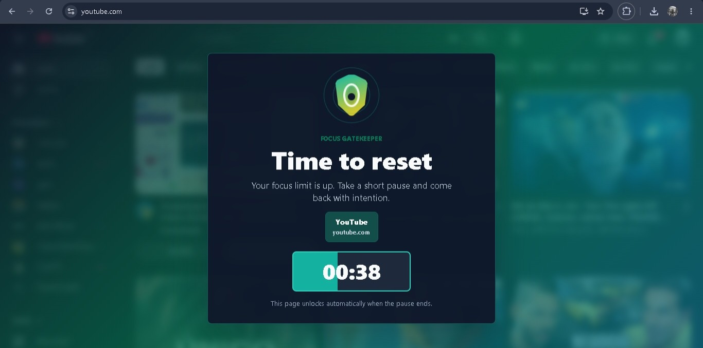
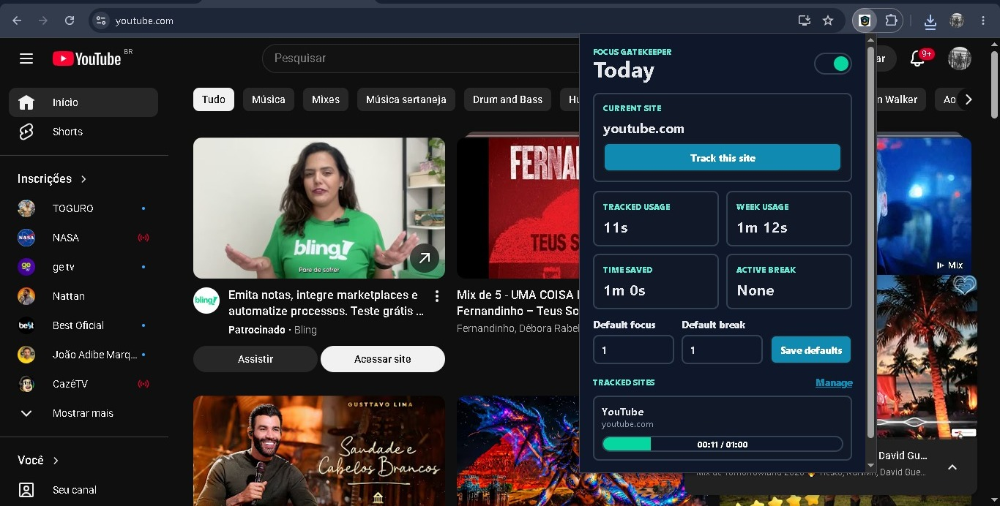
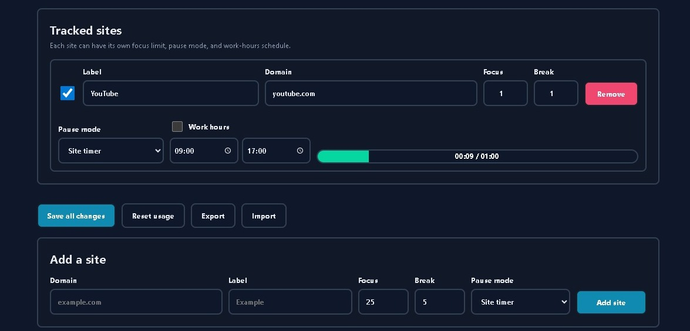
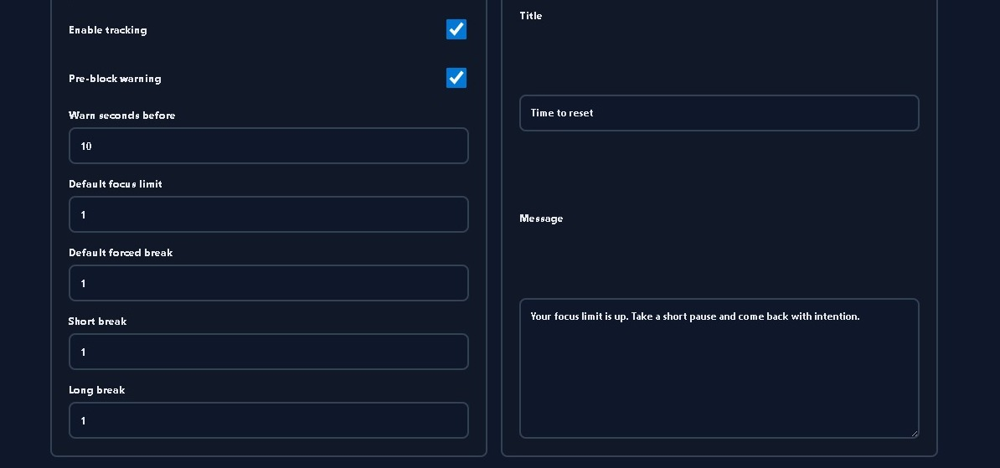
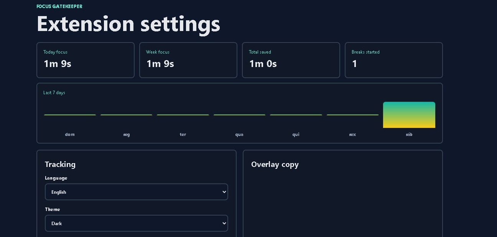

# Focus Gatekeeper

Focus Gatekeeper is a polished Manifest V3 Chrome extension for intentional browsing. It tracks active time on distracting sites, applies user-defined limits, and covers the page with a compact animated pause overlay until the break timer expires.

## Screenshots

<table>
  <tr>
    <td></td>
    <td></td>
  </tr>
  <tr>
    <td></td>
    <td></td>
  </tr>
  <tr>
    <td></td>
    <td></td>
  </tr>
</table>

## Highlights

- Chrome Manifest V3 architecture
- Active-tab and focused-window time tracking
- Per-site focus limits and pause rules
- Pause modes: site timer, short break, long break, and block until tomorrow
- Optional work-hours schedule per site
- Pre-block warning before the pause overlay appears
- Compact animated overlay with countdown and progress
- Light and dark theme support
- Popup dashboard with quick current-site tracking
- Options page with weekly stats, history, import/export, language selection, and theme controls
- English and Portuguese (Brazil) UI
- Local-first storage with no backend or analytics
- Store listing, privacy policy, permission justification, QA checklist, and demo script included

## Install Locally

1. Open Chrome.
2. Go to `chrome://extensions`.
3. Enable `Developer mode`.
4. Click `Load unpacked`.
5. Select this folder: `chrome-focus-gatekeeper`.
6. The onboarding page opens automatically on first install.

## Quick Test

1. Open the extension options.
2. Add `example.com` or update `youtube.com`.
3. Set `Focus` to `1` and `Break` to `1`.
4. Save changes.
5. Visit the tracked site and keep the tab active for about one minute.
6. Confirm the pre-block warning appears near the limit.
7. Confirm the overlay appears and unlocks when the countdown reaches `00:00`.

## Project Structure

- `manifest.json`: Chrome extension entrypoint.
- `src/background.js`: Settings, state, time tracking, stats, break sessions, and imports/exports.
- `src/content.js`: Usage ticks and overlay rendering.
- `src/popup.*`: Quick dashboard.
- `src/options.*`: Full settings and analytics.
- `src/onboarding.*`: First-run setup screen.
- `assets/`: Icons and logo.
- `store/`: Chrome Web Store listing materials and screenshots.
- `docs/`: Portfolio, demo, release, and QA materials.

## Store Prep

The `store/` directory includes:

- Chrome Web Store description
- Permission justification
- Privacy policy
- Screenshot notes and generated preview assets

For a real store submission, use the real screenshots in `store/screenshots/` and capture any additional Chrome Web Store sizes required during final submission.

## Portfolio Demo

Use `docs/DEMO_SCRIPT.md` to record a short video showing:

1. Adding a site.
2. Setting a one-minute limit.
3. Showing the pre-block warning.
4. Triggering the overlay.
5. Switching between light and dark theme.
6. Waiting for the page to unlock.

## Privacy

Focus Gatekeeper is local-first. It stores settings and usage totals in `chrome.storage.local` and does not send browsing data to any remote server.
